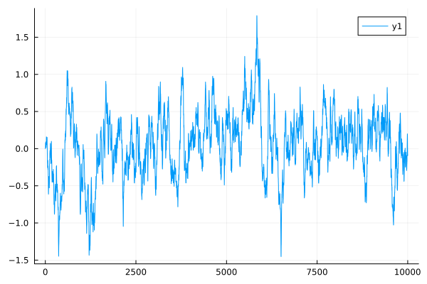
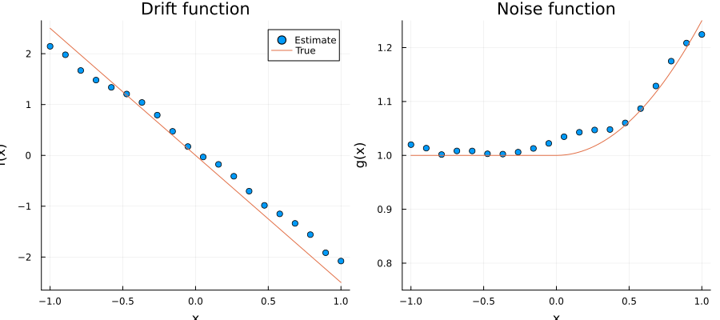
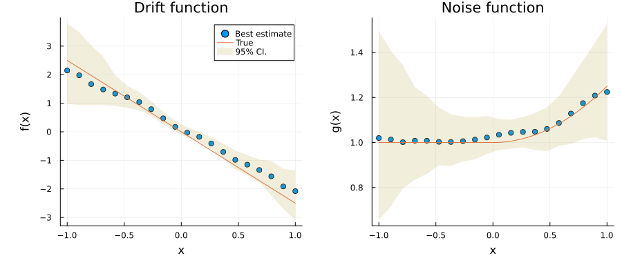

```julia
]dev ExponentialNoiseSDE
```

       Resolving package versions...
      No Changes to `~/Documents/Julia/test-ExponentialNoiseSDE/Project.toml`
      No Changes to `~/Documents/Julia/test-ExponentialNoiseSDE/Manifest.toml`


```julia
]status
```

    Status `~/Documents/Julia/test-ExponentialNoiseSDE/Project.toml`
      [e05663f3] ExponentialNoiseSDE v0.1.0 `~/.julia/dev/ExponentialNoiseSDE`
      [91a5bcdd] Plots v1.38.11


```julia
using ExponentialNoiseSDE
using DelimitedFiles
using Plots
using Plots.Measures
```


```julia
filename = "/Users/w1davis/.julia/dev/ExponentialNoiseSDE/test/data/exampleData.txt"

X_data = DelimitedFiles.readdlm(filename)[:]
N_data = length(X_data)
obs = Observation(
    X_data,
    0.0050
);
```


```julia
plot(X_data[1:10000])
```


    

    


```julia
## Conditional moment settings
nTimeShiftSamplePoints = 15
nEvalPoints = 20
xEvalLims = (-1.0,1.0)
kernel = "Epanechnikov"
bandwidth = 0.1

# Variables/attributes
timeShiftSamplePoints = collect(1:nTimeShiftSamplePoints)
momentSize = (nTimeShiftSamplePoints, nEvalPoints)

momentSettings = ConditionalMomentSettings(
    timeShiftSamplePoints,
    nEvalPoints,
    xEvalLims,
    kernel,
    bandwidth,
);
```


```julia
conditionalMoments = build_moments(obs, momentSettings);
```


```julia
modelSettings1 = ModelEstimateSettings(displayOutputFlag=false)

# Estimating
modelEstimate = estimate_model(conditionalMoments, modelSettings1);
```


```julia
bootstrapSettings1 = BootstrapSettings(nSamples=200)

bootstrapStatistics = estimate_bootstrap_statistics(modelEstimate,bootstrapSettings1);
```

    Starting correlated process regression and bootstrap iterations
    Sample: 1
    Sample: 2
    Sample: 3
    Sample: 4
    Sample: 5
    Sample: 6
    Sample: 7
    Sample: 8
    Sample: 9
    Sample: 10
    Sample: 11
    Sample: 12
    Sample: 13
    Sample: 14
    Sample: 15
    Sample: 16
    Sample: 17
    Sample: 18
    Sample: 19
    Sample: 20
    Sample: 21
    Sample: 22
    Sample: 23
    Sample: 24
    Sample: 25
    Sample: 26
    Sample: 27
    Sample: 28
    Sample: 29
    Sample: 30
    Sample: 31
    Sample: 32
    Sample: 33
    Sample: 34
    Sample: 35
    Sample: 36
    Sample: 37
    Sample: 38
    Sample: 39
    Sample: 40
    Sample: 41
    Sample: 42
    Sample: 43
    Sample: 44
    Sample: 45
    Sample: 46
    Sample: 47
    Sample: 48
    Sample: 49
    Sample: 50
    Sample: 51
    Sample: 52
    Sample: 53
    Sample: 54
    Sample: 55
    Sample: 56
    Sample: 57
    Sample: 58
    Sample: 59
    Sample: 60
    Sample: 61
    Sample: 62
    Sample: 63
    Sample: 64
    Sample: 65
    Sample: 66
    Sample: 67
    Sample: 68
    Sample: 69
    Sample: 70
    Sample: 71
    Sample: 72
    Sample: 73
    Sample: 74
    Sample: 75
    Sample: 76
    Sample: 77
    Sample: 78
    Sample: 79
    Sample: 80
    Sample: 81
    Sample: 82
    Sample: 83
    Sample: 84
    Sample: 85
    Sample: 86
    Sample: 87
    Sample: 88
    Sample: 89
    Sample: 90
    Sample: 91
    Sample: 92
    Sample: 93
    Sample: 94
    Sample: 95
    Sample: 96
    Sample: 97
    Sample: 98
    Sample: 99
    Sample: 100
    Sample: 101
    Sample: 102
    Sample: 103
    Sample: 104
    Sample: 105
    Sample: 106
    Sample: 107
    Sample: 108
    Sample: 109
    Sample: 110
    Sample: 111
    Sample: 112
    Sample: 113
    Sample: 114
    Sample: 115
    Sample: 116
    Sample: 117
    Sample: 118
    Sample: 119
    Sample: 120
    Sample: 121
    Sample: 122
    Sample: 123
    Sample: 124
    Sample: 125
    Sample: 126
    Sample: 127
    Sample: 128
    Sample: 129
    Sample: 130
    Sample: 131
    Sample: 132
    Sample: 133
    Sample: 134
    Sample: 135
    Sample: 136
    Sample: 137
    Sample: 138
    Sample: 139
    Sample: 140
    Sample: 141
    Sample: 142
    Sample: 143
    Sample: 144
    Sample: 145
    Sample: 146
    Sample: 147
    Sample: 148
    Sample: 149
    Sample: 150
    Sample: 151
    Sample: 152
    Sample: 153
    Sample: 154
    Sample: 155
    Sample: 156
    Sample: 157
    Sample: 158
    Sample: 159
    Sample: 160
    Sample: 161
    Sample: 162
    Sample: 163
    Sample: 164
    Sample: 165
    Sample: 166
    Sample: 167
    Sample: 168
    Sample: 169
    Sample: 170
    Sample: 171
    Sample: 172
    Sample: 173
    Sample: 174
    Sample: 175
    Sample: 176
    Sample: 177
    Sample: 178
    Sample: 179
    Sample: 180
    Sample: 181
    Sample: 182
    Sample: 183
    Sample: 184
    Sample: 185
    Sample: 186
    Sample: 187
    Sample: 188
    Sample: 189
    Sample: 190
    Sample: 191
    Sample: 192
    Sample: 193
    Sample: 194
    Sample: 195
    Sample: 196
    Sample: 197
    Sample: 198
    Sample: 199
    Sample: 200


## Plotting


```julia
x = modelEstimate.conditionalMoments.xEvalPoints

drift_true(x) = -2.5*x
noise_true(x) = x > 0 ? 1 + x^2/4 : 1
;
```


```julia
p1 = scatter(x,modelEstimate.driftEstimate,label="Estimate")
plot!(drift_true,label="True")
plot!(title="Drift function")
plot!(xlabel="x")
plot!(ylabel="f(x)")

p2 = scatter(x,modelEstimate.noiseEstimate,label="")
plot!(noise_true,label="")
plot!(title="Noise function")
plot!(xlabel="x")
plot!(ylabel="g(x)")
plot!(ylim=(0.75,Inf))

plot(p1,p2,size=(900,400))
```


    

    


```julia
lower_b(var) = var[:percentiles95] .|> first
upper_b(var) = var[:percentiles95] .|> last
;
```


```julia
p1 = scatter(x,modelEstimate.driftEstimate,label="Best estimate")
plot!(drift_true,label="True")
plot!(x, 
    lower_b(bootstrapStatistics.driftEstimate), 
    fillrange = upper_b(bootstrapStatistics.driftEstimate), 
    linealpha = 0.0, color=5, fillalpha = 0.15, label = "95% CI."
)
plot!(title="Drift function")
plot!(xlabel="x")
plot!(ylabel="f(x)")

p2 = scatter(x,modelEstimate.noiseEstimate,label="")
plot!(noise_true,label="")
plot!(x, 
    lower_b(bootstrapStatistics.noiseEstimate), 
    fillrange = upper_b(bootstrapStatistics.noiseEstimate), 
    linealpha = 0.0, color=5, fillalpha = 0.15, label = ""
)
plot!(title="Noise function")
plot!(xlabel="x")
plot!(ylabel="g(x)")

plot(p1,p2,size=(900,400),bottom_margin = 10mm,left_margin = 10mm)
```


    

    


```julia

```
